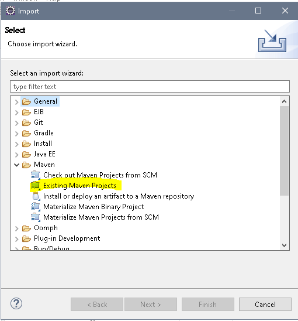
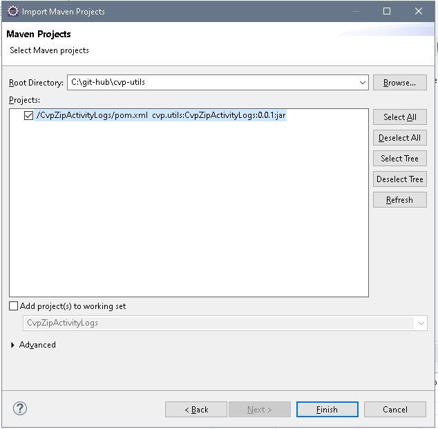
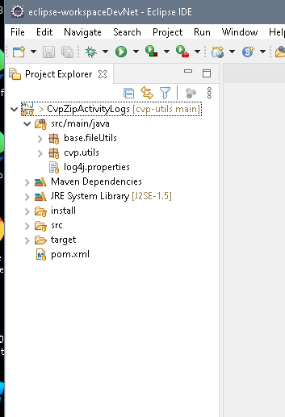
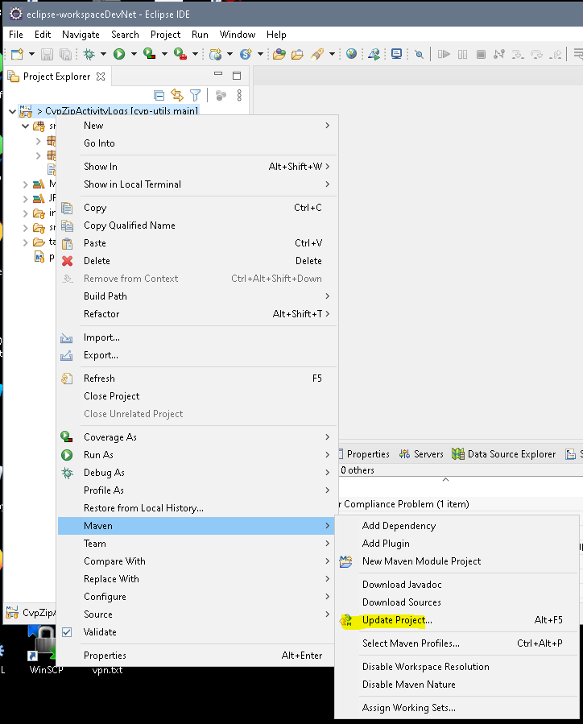
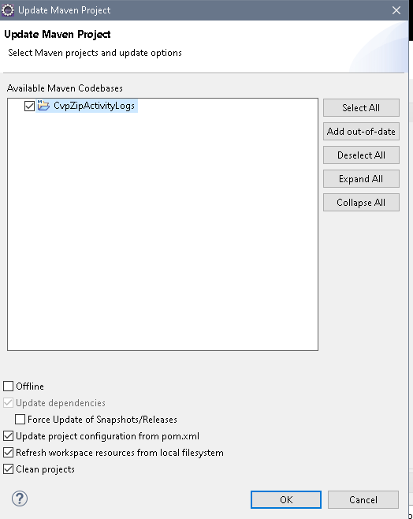
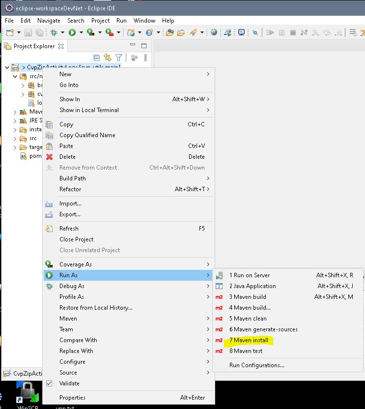
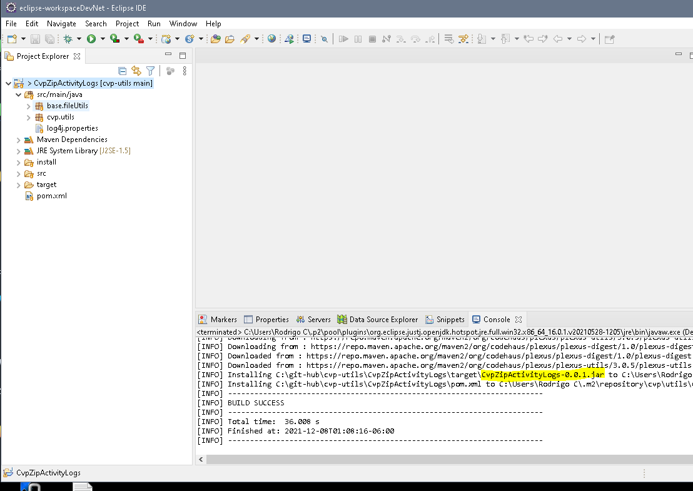

# CVP Utils: CvpZipActivityLogs
## Utility to zip activity log files of every CVP application and minimize the problem of running out space in CVP VXML Servers

CVP applications generate activity log files, depending on the number of users, nodes of the application, etc. the activity logs may grow quickly, after 100MB a new file is generated, if you don't do regular clean-up of these logs your server may run out space.

This utility can help you to minimize the effort to maintain the server with space, you can set an automated task for example to run daily at 4 am to do the clean-up of all the applications running in your server, the script creates a zip file of each file (a file with 100MB  becomes a new one with < 9MB after compressing),  in case you need to open an old log file just unzip the file.


## Screenshots

Here is an example of a CVP application which contains some logs (809 MB)


Here is an example of the script execution


After the execution of the script each of the files that meet the condition of the configuration file (example of 15 days back) is compressed  from 100 MB to < 9 MB


## Build from the source code

CvpZipActivityLogs requires JDK/JRE 1.5 or later

If you use maven

```
git clone https://github.com/rocdrigocls/cvp-utils.git

cd cvp-utils\CvpZipActivityLogs

mvn install
```

If you use eclipse

```
git clone https://github.com/rocdrigocls/cvp-utils.git

Import in eclipse as "Existing Maven Projects"

Right click in the project's folder, maven update 

Build the executable jar, right click in the folder's project: run Maven install

in the target directory will be the executable jar: CvpZipActivityLogs-0.0.1.jar
```














#### Running the script

Inside the install directory there are the required files to run the script:

-**Executable jar:** CvpZipActivityLogs-0.0.1.jar (if you wish you can build it by importing the source code)

-**Library folder:** Folder with the log4j jar needed to run

-**Configuration file:** File with parameters needed to locate the CVP applications folder

To run the script (Open cmd console from inside install folder):

```bash
java -jar CvpZipActivityLogs-0.0.1.jar CvpZipActivityLogs.properties
```

###### Configuration file (main parameters): 
```bash
#config.cvpAppsRootPath - The folder path on which CVP applications are stored
config.cvpAppsRootPath = C:\\Cisco\\CVP\\VXMLServer\\applications\\

#config.daysThatHaveToPassBeforeLogBecomeObsolete = Integer number that determines the amount of days that have to pass for the last entry of the log file to become 'Obsolete'
config.daysThatHaveToPassBeforeLogBecomeObsolete = 15
```

## License

MIT
