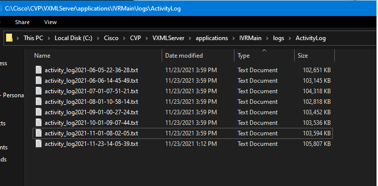
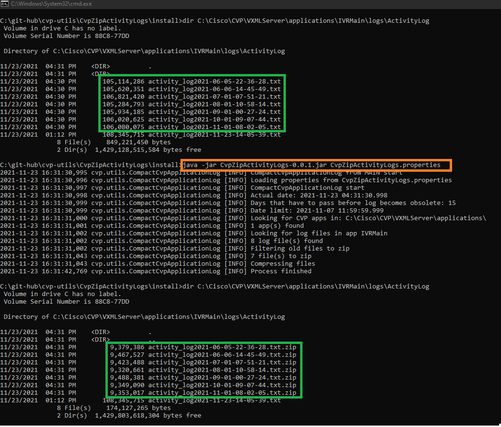
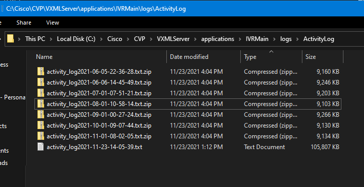

# CVP Utils: CvpZipActivityLogs
## Utility to zip activity log files of every CVP application and minimize the problem of running out of space in CVP VXML Servers

CVP applications generate activity log files, depending on the number of users, nodes of the application, etc activity logs may grow quickly, after 100MB a new file is generated, if you don't do regular clean-up of these logs your server may run out of space.

This utility can help you to minimize the effort to maintain the server with space, you can set an automated task for example to run daily at 4 am to do the clean-up of all the applications running in your server, the script creates a zip file of each file (a file with 100MB  becomes a new one with < 9MB after compressing),  in case you need to open an old log file just unzip the file.


## Features

- Import a HTML file and 








## Tech

 uses a number of open source projects to work properly:

- [AngularJS] - HTML enhanced for web apps!


And of course  itself is open source with a [public repository][dill]
 on GitHub.

## Installation

CvpZipActivityLogs requires JRE 1.5 or later, usually the JRE inside CVP VXML Server

Install the dependencies and devDependencies and start the server.

```sh
cd 
npm i
node app
```

For production environments...

```sh
npm install --production
NODE_ENV=production node app
```


#### Building from source code

For production release:

```sh
gulp build --prod
```

Generating pre-built zip archives for distribution:

```sh
gulp build dist --prod
```

## License

MIT
